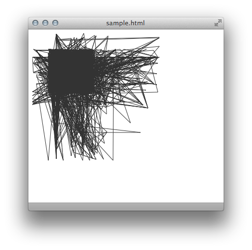

# Polygonize

Any text convert to svg polygon coordinates

## Installation

Add this line to your application's Gemfile:

    gem 'polygonize'

And then execute:

    $ bundle

Or install it yourself as:

    $ gem install polygonize

## Usage

    require 'polygonize'
	
	fill_color = 'none'
	stroke_color = '#222'
	ORIGINAL_TEXT.to_svg(fill_color, stroke_color)
	# => "<html><body>
<svg xmlns='http://www.w3.org/2000/svg'><polygon....</html>"

  

## Contributing

1. Fork it
2. Create your feature branch (`git checkout -b my-new-feature`)
3. Commit your changes (`git commit -am 'Added some feature'`)
4. Push to the branch (`git push origin my-new-feature`)
5. Create new Pull Request
